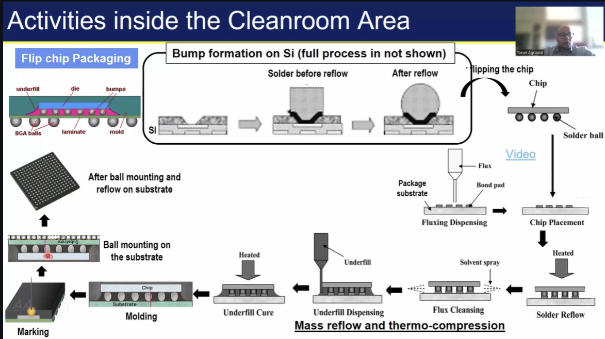
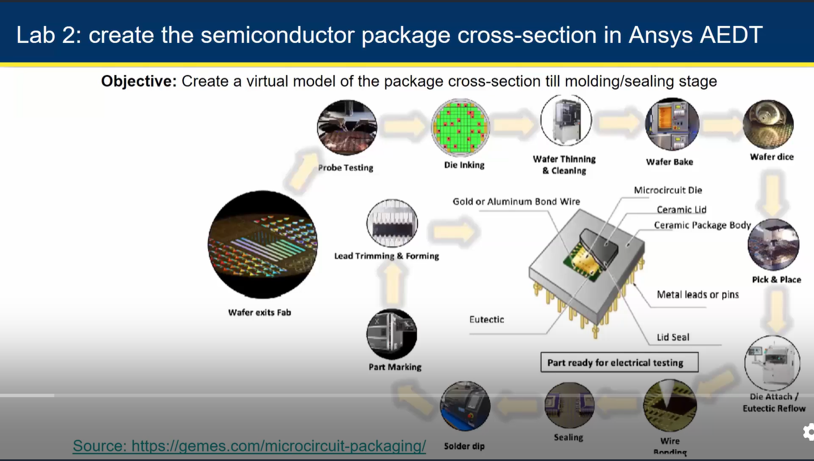

# Semiconductor packaging
This repository showcases the learnings from the 10-day workshop on Semiconductor Packaging – Fundamentals of Design and Testing, conducted by VSD Corp. Pvt. Ltd. from August 15–27, 2025.
The program delivers a comprehensive, end-to-end overview of the semiconductor packaging workflow—beginning with foundational concepts and the historical evolution of packaging technologies, and progressing to cutting-edge 2.5D and 3D integration strategies. Participants explore advanced interconnect methods, redistribution layers (RDLs), interposer design, and key assembly stages. The curriculum also covers reliability assessment techniques and culminates in practical sessions involving thermal simulation, package modeling, and design using ANSYS Electronics Desktop.
 

**Table of Contents**

 | Module # | Topic(s) Covered | Status |
 |---|---|---|
 |[**Mod. 1**](#1---packaging-evolution-from-basics-to-3d-integration) | **Packaging Evolution: From Basics to 3D Integration**   <ol> <li>[Introduction To Semiconductor Packaging And Industry Overview](#11---introduction-to-semiconductor-packaging-and-industry-overview)</li> <li>[Understanding Package Requirements And Foundational Package Types](#12---understanding-package-requirements-and-foundational-package-types)</li> <li>[Evolving Package Architectures - From Single Chip To Multi-Chip Modules](#13---evolving-package-architectures---from-single-chip-to-multi-chip-modules)</li> <li>[Interposers Re-distribution Layers And 2.5D/3D Packaging Approaches](#14---interposers-re-distribution-layers-and-25d3d-packaging-approaches)</li> <li>[Comparative Analysis And Selecting The Right Packaging Solution](#15---comparative-analysis-and-selecting-the-right-packaging-solution)</li> </ol> |  |
 |[**Mod. 2**](#2---from-wafer-to-package-assembly-and-manufacturing-essentials) | **From Wafer to Package: Assembly and Manufacturing Essentials**   <ol> <li>[Setting The Stage - Supply Chain And Facilities](#21---setting-the-stage---supply-chain-and-facilities)</li> <li>[Wafer Pre-Preparation - Grinding And Dicing](#22---wafer-pre-preparation---grinding-and-dicing)</li><li>[Wire Bond Packaging - Die Attach To Molding](#23---wire-bond-packaging---die-attach-to-molding)</li> <li>[Flip Chip Assembly - Bump Formation And Underfill](#24---flip-chip-assembly---bump-formation-and-underfill)</li> <li>[Wafer Level Packaging And Conclusion](#25---wafer-level-packaging-and-conclusion)</li> </ol> |  |
 |[**Mod. 3**](#3---labs-thermal-simulation-of-semiconductor-packages-with-ansys) | **Labs: Thermal Simulation of Semiconductor Packages with ANSYS**   <ol> <li>[Introduction And Getting Started With ANSYS Electronics Desktop](#31---introduction-and-getting-started-with-ansys-electronics-desktop)</li> <li>[Setting Up A Flip-Chip BGA Package](#32---setting-up-a-flip-chip-bga-package)</li> <li>[Material Definitions And Thermal Power Sources](#33---material-definitions-and-thermal-power-sources)</li> <li>[Meshing And Running The Thermal Analysis](#34---meshing-and-running-the-thermal-analysis)</li> <li>[Viewing Results And Exploring Other Package Types](#35---viewing-results-and-exploring-other-package-types)</li> </ol> |  |
 |[**Mod. 4**](#4---ensuring-package-reliability-testing-and-performance-validation) | **Ensuring Package Reliability: Testing and Performance Validation**   <ol> <li>[Introduction to Package Testing and Electrical Functionality Checks](#41---introduction-to-package-testing-and-electrical-functionality-checks)</li> <li>[Reliability and Performance Testing of Semiconductor Packages](#42---reliability-and-performance-testing-of-semiconductor-pack--ages)</li> </ol> |   |
 |[**Mod. 5**](#5---package-design-and-modeling-building-a-semiconductor-package-from-scratch) | **Package Design and Modeling: Building a Semiconductor Package from Scratch**   <ol> <li>[Introduction to Package Cross-Section Modeling in ANSYS Electronics Desktop (AEDT)](#51---introduction-to-package-cross-section-modeling-in-ansys-electronics-desktop-aedt)</li> <li>[Creating the Die and Substrate in AEDT](#52---creating-the-die-and-substrate-in-aedt)</li> <li>[Adding Die Attach Material and Bond Pads](#53---adding-die-attach-material-and-bond-pads)</li> <li>[Wire Bond Creation and Material Assignment](#54---wire-bond-creation-and-material-assignment)</li> <li>[Applying Mold Compound and Finalizing the Package Model](#55---applying-mold-compound-and-finalizing-the-package-model)</li> </ol> |  |
## 1 - Packaging Evolution: From Basics to 3D Integration
Semiconductor packaging is a process of enclosing a fabricated semiconductor chip(die) in a protective case that:
1. Protect it from the physical damage.
2. Provides electrical connections between the microscopic circuits on the chip and the real world .
3. Manages heat generated by the chip during operation.
**WHY IS IT NEEDED?**
Bare silicon dies are fragile and cannot be directly used in the devices .
1. Protection of chip - from physical damage ,moisture,dustand communication. 
2. Electrical connections -done between the microscopic bonding pads on the chip and the larger pins or the balls used to connect to a circuit board.
3. Heat dissipation - to prevent the overheating during operation.
4. Mechanical support - provides a stable from for assembly into devices.
5. Standardization - definesthe sizer,pin count,and the layout for the compatibility.

### 1.1 - Introduction To Semiconductor Packaging And Industry Overview
|  |
|:---:|

The semiconductor industry is the backbone of modern technology—powering everything from smartphones and laptops to cars and satellites.The semiconductor manufacturing process consists of the front-end process which refers to the wafer manufacturing and the back-end process which consists of packaging and testing. (Even the wafer manufacturing process is split into a front-end and back-end process - with the front-end typically consisting of the CMOS-making process, and the back-end comprising the metal wiring formation process that comes after the CMOS is made.)

📈** Industry Highlights:**
Global Market Size: Over $600 billion annually and growing.
Key Players: Intel, TSMC, Samsung, Qualcomm, NVIDIA, AMD.
Major Segments:
Design: Creating chip architecture (e.g., ARM, AMD).
Fabrication: Manufacturing chips (e.g., TSMC, GlobalFoundries).
Packaging & Testing: Final assembly and quality checks.
Equipment & Materials: Tools and chemicals used in production.
🌐 **Trends Shaping the Industry:**
AI & Machine Learning: Driving demand for high-performance chips.
5G & IoT: Expanding connectivity needs.
Automotive Electronics: EVs and autonomous vehicles require advanced chips.
Geopolitical Shifts: Countries investing in local fabs for security.

|  |
|:---:|

  -Companies such as Nvidia, Qualcomm, and Apple, which specialize exclusively in the architectural design and intellectual property development of semiconductor devices—without owning fabrication facilities—are categorized as *“fabless semiconductor firms"*.
  - Semiconductor products conceptualized by fabless firms are subsequently transformed into silicon wafers through advanced lithographic and fabrication processes. The industrial establishments responsible for executing these high-precision manufacturing operations are referred to as semiconductor foundries.
  -  TSMC, Global Foundries and UMC are the global companies wich include these facilities.
  -*OSAT (Out-Sourced Assembly and Test)* which include companies such as ASE and Amkor.
  - *IDMs (Integrated Device Manufacturer)* these companies do everything from design, wafer production, and packaging, to testing..
### 1.2 - Understanding Package Requirements And Foundational Package Types
#### 1.2.1 - Package Requirements
Semiconductor packages must meet a variety of technical, mechanical, and environmental demands to ensure the chip performs reliably in its intended application. Here are the key requirements:
|  |
|:---:|

The criteria for semiconductor package selection generally fall into the following key categories:
### 📦 Semiconductor Package Selection Criteria

| **Category**             | **Description**                                                                 |
|--------------------------|---------------------------------------------------------------------------------|
|  Electrical Performance | Signal integrity, power delivery, and parasitic effects (capacitance, inductance). |
|  Thermal Management     | Ability to dissipate heat efficiently; includes thermal resistance and heat sink compatibility. |
|  Mechanical Integrity   | Structural robustness, resistance to vibration, shock, and mechanical stress.   |
|  Material Compatibility | Compatibility with PCB materials, solder types, and environmental conditions.   |
|  Manufacturability      | Ease of assembly, yield rates, and compatibility with existing manufacturing processes. |
|  Interconnect Density   | Number and arrangement of I/O connections; affects size and performance.        |
|  Reliability & Durability| Long-term performance under environmental stress (humidity, temperature cycles). |
|  Cost & Availability    | Overall cost of packaging, including materials, processing, and supply chain factors. |
|  Size & Form Factor     | Physical dimensions and footprint constraints based on application requirements. |
|  Scalability & Flexibility | Ability to adapt to future upgrades or different product variants.              |

 
#### 1.2.2 - Typical Package Structure
A typical IC package consists of:
A typical Integrated Circuit (IC) package is a carefully engineered structure designed to protect the silicon die and enable its connection to the external world. Here's a breakdown of its main components:
|  |
|:---:|

🧩 Components of a Typical IC Package

1.*Silicon Die (Chip)*
The heart of the IC, where all the transistors and circuits reside.
Fabricated on a silicon wafer and then cut into individual dies.

2. *Die Attach*
A layer of adhesive or solder that secures the die to the substrate or lead frame.
Ensures mechanical stability and thermal conduction.

3. *Bonding Wires or Flip-Chip Bumps*
Wire bonding: Thin gold or aluminum wires connect the die to the package leads.
**Flip-chip**: Uses solder bumps directly on the die for connection, offering better performance.

4. *Substrate or Lead Frame*
Acts as the base of the package and provides electrical pathways.
Substrates are used in advanced packages; lead frames are common in traditional ones.

5. *Encapsulation (Mold Compound)*
A protective shell made of epoxy resin or plastic.
Shields the die and wires from environmental damage.

6.*Interconnects (Leads, Balls, Pads)*
-External terminals that connect the package to the PCB.
-Can be pins (DIP), leads (QFP), or solder balls (BGA).

7.*Heat Sink or Thermal Pad (Optional)*
-Used in high-power applications to dissipate heat.
-May be integrated into the package or added externally.

    
### 1.3 - Evolving Package Architectures - From Single Chip To Multi-Chip Modules
#### 1.3.1 Classification and Anatomy of Semiconductor Packages
   The various types of semiconductor packages can be broadly grouped into two main categories:
  - Conventional Packages
  - Wafer-level packages

In conventional packaging, the wafer is sawed into dice before the chip is packaged, while wafer-level packaging involves a part, or all, of the packaging process being performed at the wafer level before proceeding with wafer sawing:
 |  |
|:---|
###  Mounting Technologies & Package Types

| **Mounting Type**           | **Package**       | **Full Form / Description**                                               | **Examples / Notes**                                       |
|----------------------------|-------------------|---------------------------------------------------------------------------|------------------------------------------------------------|
| Through-hole Mounting    | TO                | Transistor Outline                                                        | Used for discrete transistors                              |
|                            | SIP               | Single In-line Package                                                    | Pins in a single row                                       |
|                            | DIP               | Dual In-line Package                                                      | Common for older ICs                                       |
|                            | PGA               | Pin Grid Array                                                            | High pin count, used in CPUs                               |
|  Surface Mount Technology | (T)SOT            | (Thin) Small Outline Transistor                                           | Compact transistor packaging                               |
|                            | (T)SOP            | (Thin) Small Outline Package                                              | Thin version of SOP                                        |
|                            | SOIC              | Small Outline Integrated Circuit                                          | Widely used for ICs                                        |
|                            | QFN               | Quad Flat No-leads                                                        | No leads, good thermal performance                         |
|                            | QFP               | Quad Flat Package                                                         | Leads on all four sides                                    |
|                            | PBGA              | Plastic Ball Grid Array                                                   | Balls underneath, plastic encapsulation                    |
|                            | LGA               | Land Grid Array                                                           | Pads instead of pins                                       |
|                            | FCBGA             | Flip Chip Ball Grid Array                                                 | Flip-chip bonding for high performance                     |
|                            | CSP               | Chip Scale Package                                                        | Package size ≈ chip size                                   |
|  Advanced Packages        | PoP               | Package on Package                                                        | Stacked ICs (Qualcomm SD, Apple A-Series, Exynos)          |
|                            | MCM               | Multi-Chip Module                                                         | Multiple dies in one package (e.g., Intel Broadwell)       |
|                            | SiP               | System-in-Package                                                         | Complete system in one package (e.g., Apple S1)            |
|                            | CoWoS             | Chip on Wafer on Substrate                                                | High-performance stacking (e.g., Nvidia GP100, GA100)      |

### Evolution of Package Architectures
1. Single-Chip Packages
-Traditional packaging method.
-Contains one silicon die per package.
-Examples: DIP, QFP, BGA.
-Simple, cost-effective, but limited in performance and integration.

2. System-in-Package (SiP)
;Multiple dies (logic, memory, RF, etc.) integrated into a single package.
;Enables compact systems with diverse functionalities.
;Ideal for smartphones, wearables, and IoT devices.

3. Multi-Chip Modules (MCMs)
* Multiple dies placed side-by-side or stacked within one package.
* Dies may be from different process nodes or vendors.
* Offers high bandwidth, low latency, and better power efficiency.
* Used in high-performance computing, AI accelerators, and servers.

4. 2.5D Packaging
-Uses an interposer (usually silicon) to connect multiple dies.
-Improves signal integrity and power delivery.
-Common in GPUs and data center chips.

5. 3D Packaging
#Dies are stacked vertically using Through-Silicon Vias (TSVs).
#Saves space and boosts performance.
#Ideal for memory integration (e.g., HBM with processors).

**### Why This Evolution Matters**
. Performance Boost: Shorter interconnects mean faster communication.
. Power Efficiency: Reduced parasitics and better thermal management.
. Form Factor Reduction: Smaller, thinner devices.
. Heterogeneous Integration: Mix logic, memory, analog, and RF in one package. 

##  Semiconductor Package Types

| Package Type | Full Name                      | Mounting Style     | Description                                                                 |
|--------------|--------------------------------|---------------------|------------------------------------------------------------------------------|
| DIP          | Dual In-line Package           | Through-hole        | Two parallel rows of pins; widely used in prototyping and hobby circuits     |
| SIP          | Single In-line Package         | Through-hole        | Single row of pins; compact and upright mounting                             |
| ZIP          | Zig-zag In-line Package        | Through-hole        | Pins arranged in a zig-zag pattern; used for higher density                  |
| QFP          | Quad Flat Package              | Surface-mount       | Pins on all four sides; ideal for high pin-count ICs                         |
| QFN          | Quad Flat No-leads             | Surface-mount       | No leads; pads underneath; compact and thermally efficient                   |
| BGA          | Ball Grid Array                | Surface-mount       | Solder balls underneath; used in high-performance processors                 |
| LGA          | Land Grid Array                | Surface-mount       | Flat contact pads; common in CPUs and FPGAs                                  |
| SOP          | Small Outline Package          | Surface-mount       | Smaller than DIP; pins on two sides                                          |
| TSOP         | Thin Small Outline Package     | Surface-mount       | Thinner version of SOP; used in memory chips                                 |
| CSP          | Chip Scale Package             | Surface-mount       | Very small; nearly the size of the die itself                                |
| PLCC         | Plastic Leaded Chip Carrier    | Surface-mount       | J-leads on all four sides; used in older programmable devices                |
| TO-220       | Transistor Outline Package     | Through-hole        | Metal tab for heat dissipation; used in power transistors and regulators     |
| SOT-23       | Small Outline Transistor       | Surface-mount       | Tiny package for discrete transistors and diodes                             |
| SOIC         | Small Outline Integrated Circuit | Surface-mount     | Shrunk version of DIP; common in analog and digital ICs                      |

:

### Leadframe-Based Packages
These are traditional packaging formats that rely on metal leadframes for mechanical support and electrical connections.
-Dual In-line Package (DIP): A classic format with two rows of external leads and wirebonded die. Common in prototyping and legacy systems.
-Quad Flat No-lead (QFN): A compact surface-mount package with no protruding leads and an exposed thermal pad underneath for efficient heat dissipation.
-Leadframe CSP & QFP: Chip-scale and quad flat packages built on leadframes, optimized for surface-mount technology and higher pin density.

### Laminate-Based Packages
These packages use laminated substrates to support more complex routing and better thermal performance.
-Plastic Ball Grid Array (PBGA): The die is wirebonded to a laminated substrate, with solder balls underneath for board connection.
-Flip Chip PBGA: Uses flip-chip bonding instead of wirebonds, offering superior signal integrity and thermal performance.
-Land Grid Array (LGA) & Flip Chip Chip Scale Package (FCCSP): These modern formats feature flat contact pads or chip-scale footprints, widely used in mobile and computing devices.

### Advanced Substrate Technologies
These architectures support multi-die integration and high-speed interconnects, often used in cutting-edge applications.
-2D Packaging: Multiple dies are placed side-by-side on a single substrate. Simple and cost-effective for moderate integration.

2.1D Packaging: Adds Redistribution Layers (RDLs) to reroute signals, improving layout flexibility and performance.

2.3D Packaging: Incorporates organic interposers to bridge dies, balancing performance and cost.

2.5D Packaging: Uses silicon interposers (e.g., CoWoS) to connect multiple dies with high-speed links, ideal for GPUs and data center chips.

### 1.4 - Interposers, RDLs And 2.5D/3D Packaging Approaches
#### 1.4.1 - Redistribution Layers (RDL)

 **RDLs (Redistribution Layers)**
Definition: Metal layers added to reroute I/O pads of a die to new locations.RDL (Redistribution Layer) is a metal layer added on top of a die or wafer to reroute the I/O pads to new locations. 
|  |
|:---|

*Applications of RDLs*
-RDLs are widely used in cutting-edge packaging formats where space, performance, and integration matter most:
-Fan-Out Wafer-Level Packaging (FOWLP): RDLs enable signal routing beyond the die edge, allowing for compact, high-performance packages.
-System-in-Package (SiP): Used to interconnect multiple dies (logic, memory, RF) within a single package.
-Panel-Level Packaging (PLP): RDLs support large-area manufacturing for cost-effective high-volume production.
-2.5D and 3D Integration: RDLs help connect the dies through the interposers or vertical stacking .

*Advantages of RDLs*
-RDLs offer several performance and design benefits that make them indispensable in modern IC packaging:
-**Enhanced Routing Flexibility**: Designers can relocate I/O pads to optimize signal paths and enable complex layouts.
-**Reduced Package Size**: By redistributing connections, RDLs allow for smaller, thinner packages—ideal for mobile and wearable devices.
-**Improved Signal Integrity**: Shorter and more direct interconnects reduce latency and electromagnetic interference.
-**Higher Interconnect Density**: Supports more I/O connections in a limited footprint.
- **Better Thermal Management**: Optimized layouts help distribute heat more evenly across the package.
-**Cost Efficiency**: Enables advanced packaging without the need for expensive interposers in some cases.

#### 1.4.2 - Interposers
An interposer is a substrate layer placed between the silicon dies and the package substrate. It contains fine-pitch wiring, through-silicon vias (TSVs), and redistribution layers (RDLs) to reroute signals and power between components.
They’re typically made from:
-Silicon: High precision, ideal for high-speed applications.
-Organic materials: Cost-effective and easier to process.
-Glass: Emerging option with excellent electrical insulation and dimensional stability.
#### 1.4.3 - 2.5D/3D Integration
  - **2.5D**:
  - Structure: Multiple dies placed on a shared interposer.
  - Benefits: High bandwidth, low latency, and heterogeneous integration.
  - Example: AMD’s chiplet-based CPUs.
  - **3D**: 
  - Structure: Multiple dies placed on a shared interposer.
  - Benefits: High bandwidth, low latency, and heterogeneous integration.
  - Example: AMD’s chiplet-based CPUs.

### 1.5 - Comparative Analysis And Selecting The Right Packaging Solution

|  |
|:---|

## 📦 IC Package Types and Applications

| Package Type | Full Name                      | Mounting Style     | Typical Applications                                      |
|--------------|--------------------------------|---------------------|------------------------------------------------------------|
| DIP          | Dual In-line Package           | Through-hole        | Prototyping, educational kits, legacy circuits             |
| SIP          | Single In-line Package         | Through-hole        | Simple logic ICs, vertical board mounting                  |
| QFP          | Quad Flat Package              | Surface-mount       | Microcontrollers, DSPs, GPUs                               |
| QFN          | Quad Flat No-leads             | Surface-mount       | Power management ICs, RF modules, compact electronics      |
| BGA          | Ball Grid Array                | Surface-mount       | CPUs, FPGAs, high-speed computing                          |
| LGA          | Land Grid Array                | Surface-mount       | Server processors, embedded systems                        |
| SOP          | Small Outline Package          | Surface-mount       | Memory chips, analog ICs                                   |
| TSOP         | Thin Small Outline Package     | Surface-mount       | Flash memory, DRAM                                         |
| CSP          | Chip Scale Package             | Surface-mount       | Mobile devices, wearables                                  |
| PLCC         | Plastic Leaded Chip Carrier    | Surface-mount       | Programmable logic devices, older telecom systems          |
| TO-220       | Transistor Outline Package     | Through-hole        | Voltage regulators, power transistors                      |
| SOT-23       | Small Outline Transistor       | Surface-mount       | Discrete transistors, diodes                               |
| SOIC         | Small Outline Integrated Circuit | Surface-mount     | General-purpose ICs, analog/digital converters             |

Comparative Analysis And Selecting The Right Packaging Solution:
Choosing the right packaging solution is a strategic decision that affects product safety, brand perception, cost efficiency, and environmental impact. Here's a comprehensive comparative analysis to help guide your selection:

🧃 Key Packaging Materials Compared
## 🧃 Key Packaging Materials Compared

| Packaging Type        | Pros                                                                 | Cons                                                              |
|-----------------------|----------------------------------------------------------------------|-------------------------------------------------------------------|
| Shrink Film           | - Excellent protection from dust/moisture - Transparent for easy scanning - Durable and puncture-resistant | - Requires heat to apply - Often non-biodegradable             |
| Stretch Film          | - Great for pallet security - Easy to use - Cost-effective     | - Limited protection for individual items                         |
| Bubble Wrap           | - Superior cushioning for fragile items - Lightweight             | - Bulky - Not eco-friendly unless recycled                     |
| Cardboard             | - Versatile and recyclable - Good structural support              | - Susceptible to moisture damage                                  |
| Biodegradable Options | - Eco-friendly - Enhances brand image with sustainability         | - May be costlier - Limited durability for heavy-duty use      |

Selecting the right semiconductor packaging depends on multiple criteria across performance, reliability, form factor and cost.
_________________________________________________________________________________________________________  

## 2 - From Wafer to Package: Assembly and Manufacturing Essentials
Once the semiconductor wafer fabrication is complete, the journey from raw silicon to a functional chip package involves several precision-driven steps:
-**Wafer Thinning**: The wafer is ground down to reduce thickness, improving thermal performance and enabling advanced packaging.
-**Dicing**: The wafer is sliced into individual dies using laser or mechanical sawing.
-**Die Attach**: Each die is bonded to a substrate or leadframe using adhesives or solder.
-**Interconnect Formation**: Electrical connections are made via wire bonding, flip-chip bonding, or TSVs depending on the package type.
-**Encapsulation**: The die and interconnects are sealed with molding compounds or lids to protect against environmental damage.
-**Testing**: Functional and parametric tests are performed to ensure chip reliability and performance.
-**Marking & Singulation**: Packaged units are labeled and separated for final inspection and shipment.

### 2.1 - Setting The Stage - Supply Chain And Facilities

##  Semiconductor Supply Chain Overview

| Stage                  | Description                                                                 |
|------------------------|-----------------------------------------------------------------------------|
| **Raw Material Extraction** | Silicon is purified from quartz and processed into ingots or wafers.         |
| **Wafer Fabrication**       | Transistors and circuits are formed on the wafer using photolithography, etching, and doping. |
| **Wafer Testing**           | Electrical tests are performed to identify functional dies before packaging. |
| **Wafer Dicing**            | The wafer is cut into individual dies using precision sawing or laser techniques. |
| **Die Attach**              | Each die is mounted onto a substrate or leadframe using adhesives or solder. |
| **Interconnect Formation** | Electrical connections are made via wire bonding, flip-chip, or TSVs.         |
| **Encapsulation**          | The die and interconnects are sealed to protect against environmental damage. |
| **Final Testing**          | Packaged chips undergo functional and reliability testing.                    |
| **Marking & Singulation**  | Chips are labeled and separated for shipment.                                 |
| **System Integration**     | Chips are assembled onto PCBs or modules for use in electronic products.      |

|  |
|:---|

#### 2.1.2 - Introduction to a Package Manufacturing Unit (ATMP)

| **Typical layout of an ATMP:**    |
|:---|
**Introduction to a Package Manufacturing Unit (ATMP):**
An ATMP unit is a specialized facility in the semiconductor supply chain that handles the final stages of chip production—transforming bare silicon dies into fully packaged, tested, and ready-to-use integrated circuits.

**IT INVOLVES?**
**Assembly*: Mounting the silicon die onto a substrate or leadframe, followed by interconnect formation (e.g., wire bonding, flip-chip).
**Test*: Electrical and functional testing to ensure each chip meets performance and reliability standards.
**Mark*: Laser or ink marking for identification, traceability, and branding.
**Pack*: Encapsulation and final packaging to protect the chip from environmental damage and prepare it for shipment.

**ATMP facilities are essential for:**
-Accelerating time-to-market.
-Supporting diverse applications (consumer electronics, automotive, telecom, IoT).
-Enabling vertical integration for chipmakers and system integrators.

### 2.2 - Wafer Pre-Preparation - Grinding And Dicing

 Explains  about the wafer preparation process inside an ISO Class 7 cleanroom of an ATMP (Assembly, Testing, Marking, and Packaging) facility. 
|  |
|:---|

### 2.3 - Wire Bond Packaging - Die Attach To Molding
|  |
|:---|

### 2.4 - Flip Chip Assembly - Bump Formation And Underfill

|  |
|:---|

###2.5 - Wafer Level Packaging And Conclusion

Wafer-Level Packaging (WLP)
Wafer-Level Packaging is an advanced technique where the entire packaging process is performed while the die is still part of the wafer, before dicing. This approach enables ultra-compact, high-performance packages and is widely used in mobile, IoT, and high-density applications.

**Key Features**
-True Chip-Scale Packaging: The final package size closely matches the die dimensions.

-Fan-In WLCSP: Interconnects remain within the die footprint.

-Fan-Out WLCSP: Redistribution layers (RDLs) extend beyond the die, allowing more I/O connections.

-Integrated Process Flow: Combines wafer fab, packaging, testing, and burn-in at wafer level.

**Applications**
-Smartphones and wearables

-Sensors and MEMS devices

-RF and power management ICs

-High-performance memory modules.

**Finally Wafer-Level Packaging represents a major leap in semiconductor miniaturization and integration. By performing packaging at the wafer stage, WLP enables:*
-Smaller form factors for compact devices

-Improved electrical performance through shorter interconnects

-Lower cost and higher throughput in high-volume manufacturing

-Scalability for future heterogeneous integration and 3D stacking

-As demand grows for thinner, faster, and more power-efficient electronics, WLP continues to be a cornerstone of next-generation semiconductor design.

|  |
|:---|

_________________________________________________________________________________________________________  

## 3 - Labs: Thermal Simulation of Semiconductor Packages with ANSYS tools

### 3.1 - Introduction And Getting Started With ANSYS Electronics Desktop

ANSYS Electronics Desktop{AEDT} is a unified simulation platform that integrates multiple electromagnetic, thermal, and circuit solvers under one environment. It’s widely used for designing and analyzing high-frequency, low-frequency, and electrothermal systems—such as antennas, PCBs, IC packages, motors, and connectors.

### 3.2 - Setting Up A Flip-Chip BGA Package

We will be taking an already available FC-BGA package within the Icepak Toolkit for this simulation exercise.

  - **Step 1 : Open ANSYS{AEDT} and launch the Icepak**

|  |
|:---|

  - **Step 2 : Create a Flipchip BGA Package**
    - `Icepak -> Toolkit -> Geometry -> Packages -> Flipchip_BGA`

|  |
|:---|

  - **Step 3 : The Package Configuration window opens up**
    -
 |  |    
|:---|

|  |
|:---|

|  |
|:---|

|  |
|:---|
 
| Package generated in Icepak    |
|:---|

 - **Step 3 :  3D Package Model Structure in Icepak**

|**Ball Group**   |
|:---|

|**Substrate**   |
|:---|

|**Die Underfill**   |
|:---|

|**Die**   |
|:---|

### 3.3 - Material Definitions And Thermal Power Sources

  - **Step 4 : Review and modify the material and definition types for the different components of the model.**

| Material Definitions    |
|:---|

  - **Step 5 : Use the  Source Thermal Model for Die**
    -
|Source Thermal Model for Die   |
|:---|

| |
|:---|
- **Step 5.2 : now add the  Source Thermal Model for Substrate**
    - Right click on **_Flipchip_BGA1_substrate_** under `Models -> Flipchip_BGA1_Group -> Solids` and ADD The  Thermal Source.
    -Set the substrate’s thermal boundary condition to a constant value equal to the ambient temperature
| |
|:---|

| |
|:---|

  - **Step 6 : Add Thermal monitors for the different components**
    -Models -> Flipchip_BGA1_Group -> Solids` and then choose `Assign Monitor -> Point`
    - In the sub-window select **Temperature**
    - return these process for die and the under fill.

|Add Thermal monitor for Substrate   |
|:---|

| |
|:---|

| |
|:---|

   ### 3.4 - Meshing And Running The Thermal Analysis

  - **Step 7 :1. Generating the  Mesh**
    - Click on the Simulation tab and click on **GENERATE MESH*
    -after this save the project if there is no issues found and debug if any errors found

  - **2. : REWEING THE  Mesh Quality metrics**
    -Check for the Face Alignment, Skewness and Volume once the mesh is generated.

 | |
|:---|

| |
|:---|

| |
|:---|

| |
|:---|

| |
|:---|

- **Step 8 :  Thermal Analysis**
    - 
| |
|:---|

 ### 3.5 - Viewing Results And Other Package Types

  - **Step 9 :  Validating**
    - Choose the **Validate** button in the top 
    - Ensure all checks are validated successfully

| **Validate the setup**    |
|:---|

  - **Step 10: Run the simulation and plot the temperature map**
    -  **Analyze All** button in the top ribbon  analyses all the mistakes and tells us about the mistakes which has to be corrected.
    -now DEBUG all the issues in the given left most box 
    -  Plot Fields -----> Temperature -----> Temperature`
 - different plot options:
      - Specify Name, Folder----> Plot on Surface only-----> Surface Smoothing -> Enable Gaussian Smoothing
| **Validating **    |
|:---|

| **TEMP Settings**    |
|:---|

| **Field Plot Settings**    |
|:---|

| **Field Plot - TOP view**    |
|:---|

| **Field Plot - BOTTOM view**    |
|:---|
_________________________________________________________________________________________________________  

## 4 - Ensuring Package Reliability: Testing and Performance Validation

### 4.1 - Introduction to Package Testing and Electrical Functionality Checks

In semiconductor packaging, reliability isn't just a goal—it's a necessity.ICs are tested at multiple points during the manufacturing process to ensure they meet performance, reliability, and functionality requirements. Testing takes place both at the foundry and at OSAT facilities.This phase involves rigorous procedures such as thermal cycling, drop tests, electrical continuity checks, and accelerated aging simulations. By identifying potential failure modes early, engineers can refine materials, design, and assembly processes to deliver robust, high-performance packages that meet industry standards and customer expectations.

| |
|:---|
#### 4.1.1 - Foundry Testing Stages
Foundry testing is a critical part of semiconductor fabrication, ensuring that wafers and individual dies meet stringent quality and performance standards before packaging and deployment. Here's a breakdown of the key stages:
**1. Front-End Manufacturing**
**2. Wafer Probe Test**

#### 4.1.2 - OSAT Testing Stages
##  OSAT Testing Stages

| Stage No. | Testing Stage           | Description                                                                 |
|-----------|-------------------------|-----------------------------------------------------------------------------|
| 1         | Wafer Sawing            | Slicing the wafer into individual dies using precision dicing tools.       |
| 2         | Die Attach              | Bonding each die to a substrate or package using adhesive or solder.       |
| 3         | Wire Bonding / Flip-Chip | Creating electrical connections via wire bonds or solder bumps.            |
| 4         | Encapsulation           | Molding the package to protect the die from environmental damage.          |
| 5         | Pre-Test Inspection     | Visual and automated checks for defects before electrical testing.         |
| 6         | Electrical Testing      | Verifying functionality, signal integrity, and power characteristics.      |
| 7         | Burn-In Testing         | Stress testing under elevated temperature and voltage to detect failures.  |
| 8         | Final Inspection        | Marking, labeling, and visual inspection for compliance and quality.       |
| 9         | Packing & Shipping      | Packaging chips in trays or reels for delivery to customers.               |

| |
|:---|

**4. System Level Testing (SLT)**
  - Testing is performed in conditions that closely mimic real-world system operation. SLT verifies how a chip behaves when it runs actual software or firmware inside a system-like environment.

Processing Zone (Clean room: ISO class 6 & 7): This area handles initial packaging steps in a controlled environment. Key activities include die bonding, wire or flip-chip bonding, encapsulation, and RDL (Redistribution Layer) formation. Inspection is integral to the manufacturing process to ensure quality. Packages are loaded onto a tray after singulation, as shown in the image with a tray of individual packaged chips.
-Testing Area (Electrical, burn-in, and reliability chamber tests): This area focuses on validating the packaged chips. The process involves:
-**AOST (Assembly Open and Short Test)**: Checks for open circuits and short circuits on the package board, using a package socket.
| |
|:---|

### 4.2 - Reliability and Performance Testing of Semiconductor Packages

#### 4.2.1 Burn-in and Final Test

**1. Burn-In Test**

  Burn-in testing is a reliability screening process used in semiconductor manufacturing to identify early-life failures in integrated circuits. By subjecting devices to elevated temperatures and voltages for extended periods, this test accelerates aging and stress conditions that mimic real-world usage. The goal is to ensure only robust, defect-free chips move forward in the production pipeline, enhancing long-term performance and reducing field failures.

| |
|:---|

**2. Final Test (FT)**

   Its purpose is to verify that each integrated circuit (IC) meets all functional and performance specifications before shipment
 
| |
|:---|

**Summary: ATE & Test Categories**
### 📊 Summary: ATE & Test Categories

| **Test Category**       | **Purpose**                                              | **ATE Role**                                               | **Stage**             |
|-------------------------|----------------------------------------------------------|-------------------------------------------------------------|-----------------------|
| Wafer Sort              | Identifies functional dies on wafer                      | Uses probe cards to test each die                           | Pre-packaging         |
| Parametric Test         | Measures electrical parameters (e.g., voltage, current)  | Precision instruments integrated into ATE                   | Wafer & Final Test    |
| Burn-In Test            | Accelerates aging to catch early failures                | Applies elevated voltage and temperature                    | Mid-stage             |
| Functional Test         | Verifies logical and operational correctness             | Executes test patterns and compares outputs                 | Final Test            |
| Speed Binning           | Classifies chips by performance                          | Measures timing and speed under load                        | Final Test            |
| Environmental Screening | Simulates real-world stress conditions                   | Controls temperature, vibration, humidity                   | Final Test            |
| ESD & Latch-Up Test     | Ensures robustness against electrostatic discharge       | Applies controlled ESD pulses and monitors response         | Reliability Testing   |
| Failure Analysis        | Diagnoses root causes of defects                         | Interfaces with diagnostic tools (e.g., SEM, X-ray)         | Post-test investigation |

| |
|:---|

## 5 - Package Design and Modeling:TO BUILD A SEMICONDUCTOR PACKAGE FROM THE BEGINNING

## 5.1 - Introduction to Package Cross-Section Modeling in ANSYS Electronics Desktop (AEDT)

*This lab activity emphasizes constructing a full structural representation of a wire bond package—comprising the die, substrate, interconnect wires, and encapsulating mold—without engaging in simulation or analytical evaluation.**

| |
|:---|

##  Package Design and Modeling: Building a Semiconductor Package from Scratch

*Designing a semiconductor package from the ground up involves a multi-disciplinary approach that integrates electrical, thermal, and mechanical considerations. The process typically includes:*

| **Stage**                  | **Description**                                                                 |
|---------------------------|---------------------------------------------------------------------------------|
| Requirements Definition   | Define electrical, thermal, and mechanical specs based on chip and system needs. |
| Substrate Design          | Design the interposer or substrate layout including layer stack-up and routing. |
| Die Placement             | Position the silicon die(s) on the substrate for optimal signal and thermal flow. |
| Interconnect Modeling     | Choose and model interconnects (wire bonds, flip-chip bumps, TSVs, etc.).       |
| Thermal Simulation        | Use tools like ANSYS Icepak to simulate heat dissipation and optimize cooling.  |
| Mechanical Analysis       | Evaluate stress, warpage, and reliability under environmental conditions.       |
| Signal Integrity Modeling | Simulate high-speed signal paths to minimize noise and crosstalk.               |
| Final 3D Package Model    | Generate a complete 3D model for manufacturing and validation.                   |

##  Wire Bond Package Components

| Component               | Properties                                                                 |
|------------------------|----------------------------------------------------------------------------|
| **1. Die**             | - Material: Silicon - Dimensions: 3mm × 3mm - Die Height: 200 µm    |
| **2. Substrate**       | - Material: FR4 - Dimensions: 5mm × 5mm - Height: 500 µm            |
| **3. Die Attach**      | - Material: Modified Epoxy - Dimensions: 3mm × 3mm  - Thickness: 100 µm |
| **4. Die Bond Pads**   | - Material: Copper - Dimensions: 0.2mm × 0.2mm - Thickness: 5 µm    |
| **5. Substrate Pads**  | - Material: Copper - Dimensions: 0.2mm × 0.2mm - Thickness: 10 µm   |
| **6. Bond Wire**       | - Material: Gold Wire- Type: JEDEC 4-point                             |
| **7. Mold Compound**   | - Material: Epoxy
  - **Step 1 :SELECT AEDT and choose the Q3D (or Icepak, Maxwell 3D)**

## 🚀 Launching AEDT and Selecting Simulation Modules

| **Step** | **Action**                                      | **Description**                                                                 |
|----------|--------------------------------------------------|----------------------------------------------------------------------------------|
| 1        | Open ANSYS Electronics Desktop (AEDT)            | Start the AEDT application from your desktop or start menu.                      |
| 2        | Create a New Project                             | Go to File → New → Projec to begin a fresh simulation setup.                 |
| 3        | Select Desired Module                            | Choose from available solvers:                                                  |
|          |                                                  | - **Q3D Extractor**: For parasitic extraction and signal integrity analysis.     |
|          |                                                  | - **Icepak**: For thermal simulation of electronic packages.                     |
|          |                                                  | - **Maxwell 3D**: For electromagnetic field simulation in 3D structures.         |
| 4        | Configure Units and Environment                  | Set working units (e.g., mm, µm) via

|  |
|:---|
###  Creating the Die and Substrate in AEDT

  - **Step 2 : Defining the working unit**
    -The working unit may consist of a silicon die, substrate, bond wires, die attach material, and mold compound.
     -It serves as the reference model for design validation, material characterization, and process optimization.
    - create the working model using **mm** or **um**.

###   - Creating the Die and Substrate in AEDT

| **Step** | **Action**                            | **Description**                                                                 |
|----------|----------------------------------------|----------------------------------------------------------------------------------|
| 1        | Launch AEDT                            | Open ANSYS Electronics Desktop and start a new project.                          |
| 2        | Select Simulation Module               | Choose Icepak, Q3D, or Maxwell 3D depending on the analysis type.                |
| 3        | Set Units                              | Go to Modeler → Units` and select appropriate units (e.g., mm, µm).             |
| 4        | Create Substrate Geometry              | Use Draw → Box or Draw → Rectangle` to define the substrate dimensions.       |
| 5        | Assign Material to Substrate           | Apply materials like FR4, ceramic, or custom definitions via the material library.|
| 6        | Create Die Geometry                    | Draw a smaller box on top of the substrate to represent the silicon die.         |
| 7        | Define Die Material                    | Assign silicon or other semiconductor material to the die.                       |
| 8        | Position Die on Substrate              | Use alignment tools to place the die accurately on the substrate surface.        |
| 9        | Save and Prepare for Meshing           | Save the model and proceed to mesh setup for simulation.                         |

|  |
|:---|
  - ** : Create the Die Geometry**
##  Rectangle Creation and Sheet Thickening Steps

| Step No. | Action Description                                                                 | Menu Navigation / Tool Used                        | Parameters / Values            |
|----------|-------------------------------------------------------------------------------------|----------------------------------------------------|--------------------------------|
| 1        | Select the rectangle drawing tool                                                  | Draw -> Rectangle` or Ribbon Tool                 | —                              |
| 2        | Open properties dialog for the created rectangle                                   | Double-click Model -> Rectangle1`                 | —                              |
| 3        | Set rectangle position and dimensions                                              | In Properties Dialog                               | Origin: (0, 0, 0) Size: 3mm × 3mm |
| 4        | Thicken the rectangle sheet                                                        | Modeler -> Surface -> Thicken Sheet...`           | Thickness: 200 microns (0.2mm) |

>  Tip: Ensure units are set to millimeters before specifying dimensions to avoid scaling issues.

  - **Step 3.2 : Assigning the  Material Properties**
|  |
|:---|
  - **Step 4.1 : Creating the Substrate Geometry**
##  Substrate Definition and Positioning Steps

| Step No. | Task Description                                                                 | Navigation / Tool Used                        | Input Parameters / Notes                     |
|----------|-----------------------------------------------------------------------------------|-----------------------------------------------|----------------------------------------------|
| 1        | Initiate drawing of a new rectangle to represent the substrate                   | Use Draw -> Rectangle` from the toolbar      | Dimensions: 5mm × 5mm                         |
| 2        | Set the initial placement of the substrate rectangle                             | Access via Model -> Rectangle2`              | Coordinates: (-1, -1, 0)                      |
| 3        | Apply thickness to the substrate geometry                                        | Navigate to Modeler -> Surface -> Thicken Sheet...` | Thickness: -500 microns (-0.5mm) Negative value ensures it lies below the die |
| 4        | Modify the Z-axis position to include die attach layer offset                   | Update position in the Properties Dialog      | Final Position: (-1, -1, -0.1)                |

>  **Note:** The negative Z-offset accounts for the die attach layer, ensuring proper vertical alignment between die and substrate.

### 5.3 - Adding Die Attach Material and Bond Pads

  - **Step 5 : Create the Die Attach Material**
    
  - **Step 6 : Create Bond pads on Die and Substrate**
  - Draw a small rectangle and configure its size to to that of the die pad (0.2mm x 0.2mm). We will place the first Die Pad at the co-ordinates (0.2, 0.2, 0.2) so that it sits on top of the die and is at one of the edges.
  - Set the thickness to 5 microns (0.005mm)
  - Similarly, draw a small rectangle and configure its size to to that of the substrate bond pad (0.2mm x 0.2mm).
  - We will place this Substrate Bind Pad at the co-ordinates (0.2, -0.7, -0.1) so that it sits aligned to the Die bond pad created in the previous step, and also on top of the substrate.
  - Set the substrate bond pad thickness to 10 microns (0.010mm)

### 5.4 - Wire Bond Creation and Material Assignment

| **Draw the Bondwire connecting the die & substrate pad centers**   |
|:---|

### 🧵 Drawing the Bondwire: Connecting Die & Substrate Pad Centers

| **Step** | **Action**                                | **Description**                                                                 |
|----------|--------------------------------------------|----------------------------------------------------------------------------------|
| 1        | Open AEDT and Load Your Project            | Launch AEDT and open the project containing your die and substrate geometry.     |
| 2        | Switch to 3D Modeler                       | Ensure you're in the 3D Modeler environment to access wire drawing tools.        |
| 3        | Identify Pad Centers                       | Use the coordinate system or snapping tools to locate the center of each pad.    |
| 4        | Select “Draw → Bondwire” Tool              | Activate the bondwire drawing tool from the toolbar or menu.                     |
| 5        | Define Start and End Points                | Click on the die pad center, then the substrate pad center to define the wire path.|
| 6        | Set Wire Properties                        | Specify wire material (e.g., gold, aluminum), diameter, and loop height.         |
| 7        | Adjust Loop Profile                        | Modify the wire loop shape for mechanical clearance and signal

Now, repeat the steps 6 and 7 to create and connect all the die and substrate bond pads using bondwires.

|  |
|:---|

### Applying Mold Compound and Finalizing the Package Model

| **Step** | **Action**                          | **Description**                                                                 |
|----------|--------------------------------------|----------------------------------------------------------------------------------|
| 1        | Prepare Mold Setup                   | Align the wire-bonded die and substrate within the mold cavity.                  |
| 2        | Inject Mold Compound                 | Use transfer molding to inject epoxy-based resin over the die and wires.         |
| 3        | Ensure Uniform Coverage              | Verify that the compound flows evenly to encapsulate all components.             |
| 4        | Cure the Mold Compound               | Apply heat to solidify the resin, forming a protective shell around the package. |
| 5        | Inspect for Voids or Cracks          | Perform visual or X-ray inspection to detect molding defects.                    |
| 6        | Laser Marking                        | Engrave identification codes, logos, or batch numbers on the molded surface.     |
| 7        | Singulation                          | Cut the molded wafer into individual packages using a precision dicing blade.    |
| 8        | Final Electrical Test                | Conduct post-mold testing to ensure package integrity and performance.           |
| 9        | Ready for Shipment                   | Package units are now ready for final inspection

|  |
|:---|

| **THE FINAL RESULT:**    |
|:---|

______________________________________________________________________________________________________________
  _________________________________________________________________________________________________________ 

